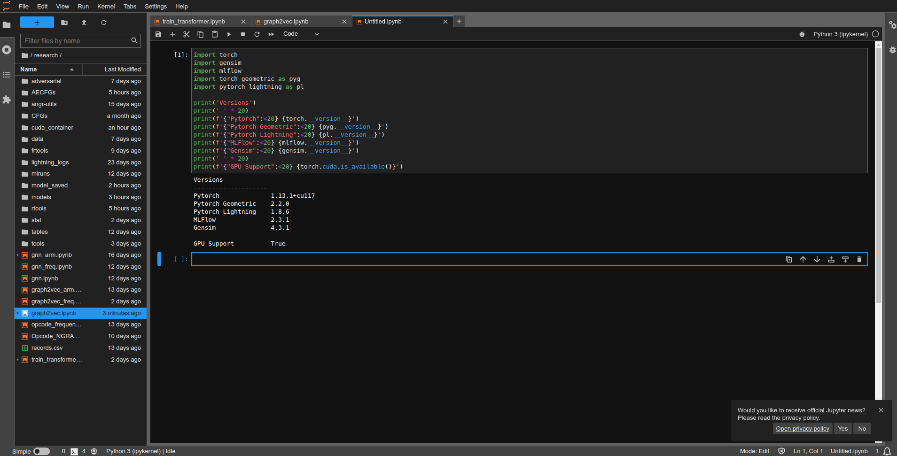

# Docker installation

## Requirement
OS: Ubuntu 20.04  
GPU: RTX 3080ti

## Installation
This repository is the installer of docker and nvidia-container for Ubuntu 20.04.  
In order to create a container environment for CUDA support in deep learning.  
```
bash install.sh
```

Reference:  
- [installation guide](https://medium.com/%E5%B7%A5%E7%A8%8B%E9%9A%A8%E5%AF%AB%E7%AD%86%E8%A8%98/docker-%E5%BB%BA%E7%AB%8B-cuda-%E5%8F%8A-cudnn-%E7%92%B0%E5%A2%83-2d0684b16df3)
- [docker offical](https://docs.docker.com/engine/install/ubuntu/)
- [nvidia offical](https://docs.nvidia.com/datacenter/cloud-native/container-toolkit/install-guide.html)

To test the GPU support
```
bash test_gpu.sh
```
You should see output like below if your installation works correctly.
```
+-----------------------------------------------------------------------------+
| NVIDIA-SMI 515.86.01    Driver Version: 515.86.01    CUDA Version: 11.7     |
|-------------------------------+----------------------+----------------------+
| GPU  Name        Persistence-M| Bus-Id        Disp.A | Volatile Uncorr. ECC |
| Fan  Temp  Perf  Pwr:Usage/Cap|         Memory-Usage | GPU-Util  Compute M. |
|                               |                      |               MIG M. |
|===============================+======================+======================|
|   0  NVIDIA GeForce ...  Off  | 00000000:01:00.0 Off |                  N/A |
|  0%   35C    P8    25W / 400W |  10980MiB / 12288MiB |      0%      Default |
|                               |                      |                  N/A |
+-------------------------------+----------------------+----------------------+
                                                                               
+-----------------------------------------------------------------------------+
| Processes:                                                                  |
|  GPU   GI   CI        PID   Type   Process name                  GPU Memory |
|        ID   ID                                                   Usage      |
|=============================================================================|
+-----------------------------------------------------------------------------+
```

**Note:** If you would like to make your current user running `docker` command without `sudo`
```
sudo usermod -aG docker $(whoami)
# sudo reboot 0
```

## Quick Start
To start a container for jupyter lab with conda installed, I personally recommend use [iot-salzburg/gpu-jupyter](https://github.com/iot-salzburg/gpu-jupyter) container images.  
1. Modify the configuration in `run.sh`
```
# docker image version
VERSION=gpu-jupyter:v1.4_cuda-11.6_ubuntu-20.04_python-only

# exposed port
PORT=8888

# mounting directory
MOUNT_DIR=$(pwd)

# name of the container
NAME=CUDA_JUPYTER
```
2. Start your container
```
bash run.sh
```

If you are opening the service in remote machine, you can forward the port using ssh.
```
ssh -NfL <local port>:localhost:<remote port> <username>@<ip address>
```
And open your browser with url `localhost:<port>`


**Example:**
```
# On remote machine
user@remote_machine ~$ cd my_dir
user@remote_machine ~$ bash run.sh  # suppose port exposed on 9999

# On local machine
local_user@local_machine ~$ ssh -NfL 10000:localhost:9999 user@<IP>
# Open browser with URL: localhost:10000
```



